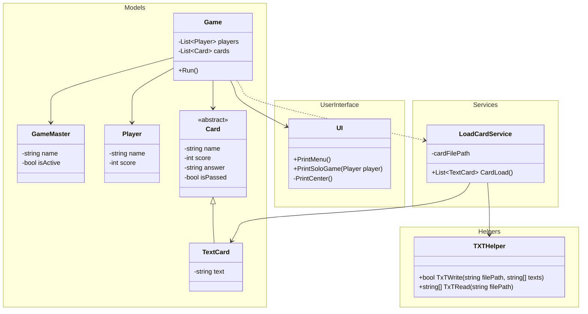
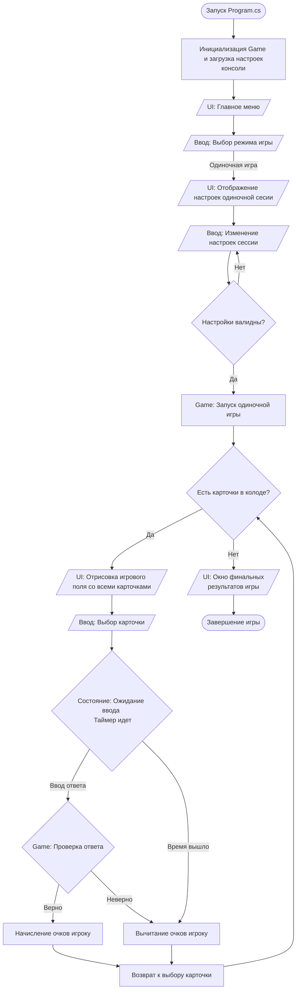

# 🎮 QuizGame (In Development)

**QuizGame** — это консольная игра-викторина на языке C#, в которой игроки могут отвечать на вопросы, соревноваться и проверять свои знания. Проект находится на этапе активной разработки.

---

## 🖼️ Скриншоты и демонстрация
*Как выглядит консольное приложение на данный момент:*

*Рис 1. Текущая реализация стартового консольного меню.*

---

## 🛠️ Текущий статус разработки
На данный момент заложена архитектурная основа проекта и реализован текстовый каркас:

* **Интерфейс:** Создано консольное главное меню с текстовой навигацией.
* **Core-архитектура:** Написаны базовые классы для управления сущностями (вопросы `Card` и `TextCard`, игроки `Player`).

---

## 💾 Работа с файлами (TXT)
Вся динамическая информация в игре вынесена за пределы кода:
* **Вопросы:** Хранятся в специальном текстовом формате во внешних `.txt` файлах. Это позволяет легко редактировать и добавлять новые викторины без пересборки игры.
* **Настройки:** Параметры игры (например, время на ответ, количество вопросов в сессии, цветовая палитра консоли) также считываются из конфигурационного `.txt` файла при старте приложения.

---

## 🗺️ Дорожная карта (Roadmap)

- [x] Разработать структуру классов и текстовое меню.
- [ ] Настроить парсинг вопросов и конфигурации из `.txt` файлов.
- [ ] **Одиночный режим (Solo):** Логика последовательного вывода вопросов, валидация ответов и подсчет финальных очков.
- [ ] **Локальный мультиплеер (В планах):** Режим игры для нескольких игроков за одним компьютером (поочередные ходы).
- [ ] **Стековый мультиплеер (В планах):** Полноценная сетевая игра по архитектуре Клиент-Сервер.

---

## 📊 Блок схемы и диограммы

### Диаграмма классов

### Блок-схема игрового цикла

---
